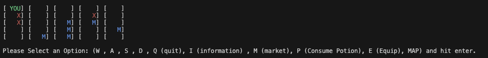
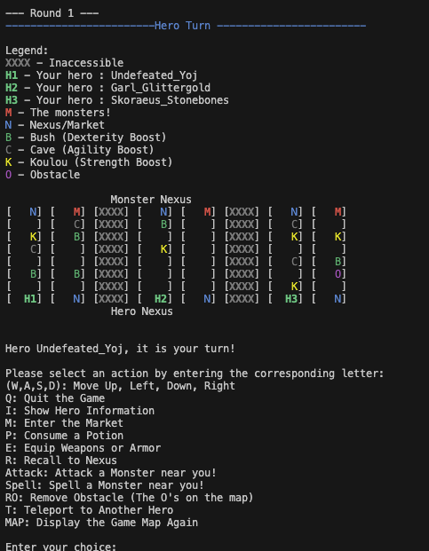
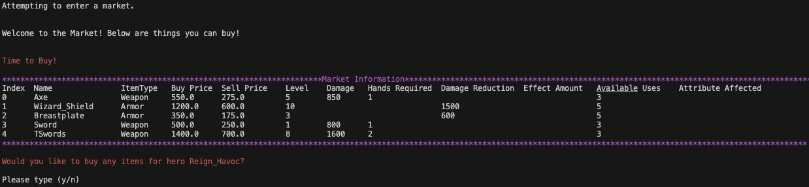
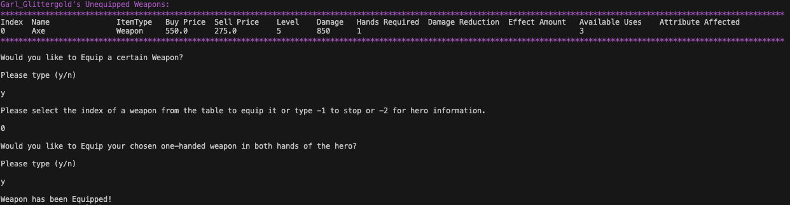
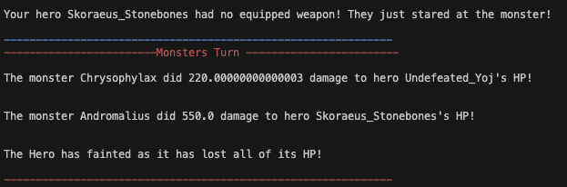

# Monsters and Heroes Game Collection

A comprehensive Java-based terminal gaming suite featuring two immersive RPG experiences: **Monsters and Heroes** and **Legends of Valor**. Built with software engineering principles and design patterns.

## Games Overview

### Monsters and Heroes
A classic turn-based RPG where heroes venture through procedurally generated worlds, engaging in strategic combat with monsters while managing inventory, equipment, and character progression.

**Key Features:**
- Scalable board size (5x5 to 9x9)
- Flexible party composition (1-3 heroes)
- Dynamic market system
- Strategic combat with multiple action types
- Character progression and inventory management

### Legends of Valor
An advanced variant extending Monsters and Heroes with lane-based tactical gameplay on an 8x8 grid battlefield.

**Key Features:**
- Three-lane strategic battlefield
- Terrain-based bonuses (Bush/Cave/Koulou)
- Advanced hero abilities (Recall, Teleportation)
- Nexus-based victory conditions
- Enhanced tactical depth

## Game Screenshots

### Main Game Boards

#### Monsters and Heroes - Main Board
The core gameplay interface showcasing the strategic grid-based movement system with heroes (H), market spaces (M), and inaccessible terrain (X). Monsters may spawn in unoccupied spaces. This demonstrates the procedurally generated world layout with clear visual indicators for different game elements.



#### Legends of Valor - Main Board
As an extension of Monster and Heroes, Legends of Valor introduces an enhanced 8x8 battlefield featuring a three-lane tactical system. Notice the specialized terrain types: Bush spaces (B) providing dexterity bonuses, Cave spaces (C) offering agility boosts, and Koulou spaces (K) enhancing strength. The Nexus positions (N) are marked at opposite ends of each lane, signifying the spawn points of both heroes and monsters. 



### Gameplay Features

#### Hero Management Interface
Comprehensive character statistics display showing detailed hero attributes including level, experience points, health/mana pools, and equipment loadouts. The interface provides clear visibility into character progression and current status effects.


#### Market System
Interactive marketplace interface allowing heroes to buy and sell weapons, armor, potions, and spells. The system displays item statistics, pricing, and inventory management with intuitive navigation controls.



#### Equipment Management
Dynamic equipment system showcasing the weapon equipping process. Heroes can manage multiple weapon types and take advantage of damage multipliers if they have the required strength/dexterity levels, providing strategic depth to combat preparation.



#### Combat System
Turn-based combat interface demonstrating monster engagement mechanics. The system displays combat statistics and damage calculations. 



## Architecture and Design Patterns

This codebase demonstrates enterprise software engineering principles through clean architecture and proven design patterns:

### Core Design Patterns
- **Factory Pattern**: Modular creation of heroes, monsters, and items with dedicated factories
- **Strategy Pattern**: Flexible combat actions (Attack, Spell, Potion, Equip strategies)
- **Singleton Pattern**: Centralized input handling via `ScannerSingleton`

### Architectural Principles
- **Single Responsibility Principle**: 40+ focused classes, each with clear responsibilities
- **Package-based Organization**: Logical separation into models, controllers, strategies, factories, ui, and utils
- **Inheritance Hierarchy**: Strategic use of abstract classes and interfaces for code reuse
- **Scalable Design**: Configurable game parameters and extensible framework

### Package Structure
```
├── controllers/     # Game logic and flow control
├── models/         # Core game entities (Hero, Monster, Player, etc.)
├── factories/      # Factory pattern implementations
├── strategies/     # Strategy pattern for combat actions
├── ui/            # Board and game piece representations
├── utils/         # Utility classes and helpers
└── resources/     # Game data files
```

## Getting Started

### Prerequisites
- Java 8 or higher
- Terminal/Command line access

### Build and Run
```bash
# Navigate to project root
cd /path/to/Monsters-And-Heroes

# Compile all Java files
find . -name "*.java" > sources.txt && javac @sources.txt

# Run the game
java controllers.Main
```

### Alternative (IDE)
Run the `main()` method in `controllers/Main.java`

## Additional Resources

For comprehensive implementation details, advanced features documentation, and complete gameplay mechanics, see the [Extended README](ExtendedReadMe.md).

## Contributors

- **Prathmesh Sonawane** - prsona@bu.edu
- **Haixi Zhang** - haixi23@bu.edu

---

This project demonstrates professional software engineering practices including design patterns, clean architecture, and scalable code organization.

